# <font color=#0000FF>SQL語法</font>
## <font color=#FF6600>SELECT</font>
```sql
SELECT 列名稱 FROM 表名稱;
```
也可以使用*來選擇所有列。
```sql
SELECT * FROM Persons;
```
顯示出Persons這張表的全部資料。

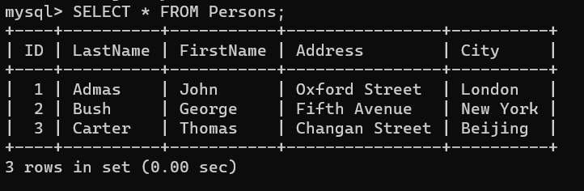
```sql
SELECT LastName, FirstName FROM Persons;
```
顯示出LastName和FirstName的列的內容。

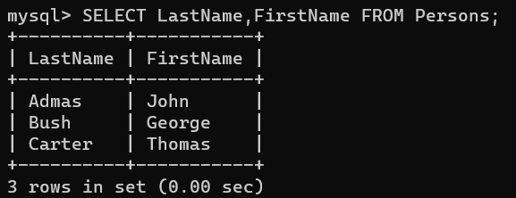
## <font color=#FF6600>DISTINCT</font>
當你有個像是這樣的表，你想過濾掉Company的重複值，就可以使用DISTINCT。

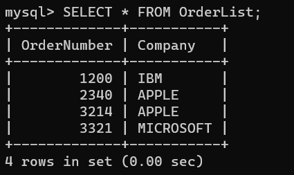
```sql
SELECT DISTINCT Company FROM OrderList;
```
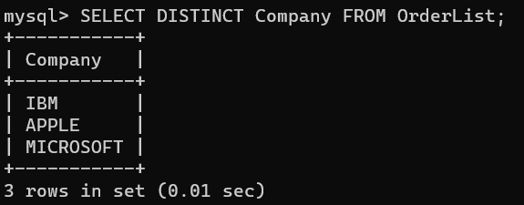
## <font color=#FF6600>WHERE</font>
WHERE可以用來指定條件，通常會接在指令的最後面，例如:
```sql
SELECT 列名稱 FROM 表名稱 WHERE 運算符(條件);
```
常見的運算符有以下幾種:
|運算符|意義|
|----|----|
|=|等於|
|!=|不等於|
|<>|不等於|
|>|大於|
|<|小於|
|>=|大於等於|
|<=|小於等於|
|BETWEEN|在某個範圍內|
|LIKE|某種搜尋模式|

假設我要查詢這張表City等於London的人我可以這樣寫:


```sql
SELECT * FROM Persons WHERE City = 'London';
```
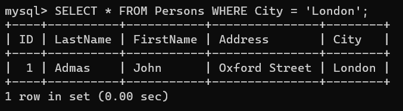

在SQL語法中也能使用AND或OR，用法與一般程式語言一樣。


若我想在上述表格取出公司是IBM或蘋果的紀錄，可以使用OR語法:
```sql
SELECT * FROM OrderList WHERE Company ='APPLE' OR Company ='IBM';
```
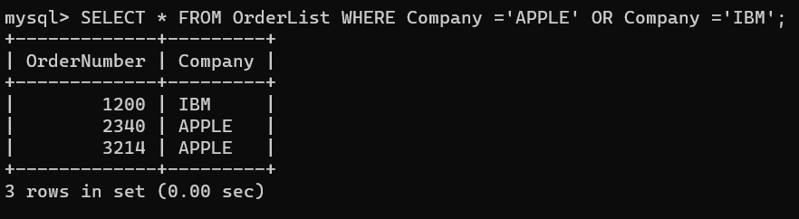
想取出公司名為APPLE並且OrderNumber為2340的紀錄，可以使用AND:
```sql
SELECT * FROM OrderList WHERE Company = 'APPLE' AND OrderNumber = 2340;
```
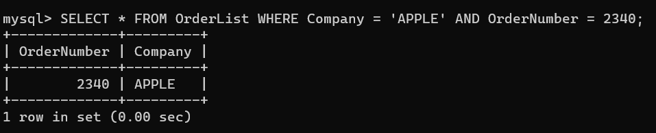
## <font color=#FF6600>ORDER BY</font>
ORDER BY 專門用來進行排序，默認以升序進行排序。
同樣以上個例子的表進行舉例:
```sql
SELECT Company, OrderNumber FROM OrderList ORDER BY OrderNumber;
```
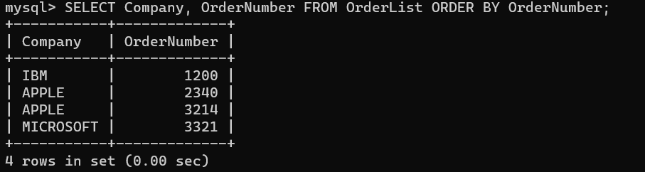

這樣就能使用OrderNumber進行升序排序。
也可以用在兩個欄位上，優先使用前者若前者一樣在使用後者排序。<br/>
也可以利用DESC以及ASC分別表示升序以及降序:
```sql
SELECT Company, OrderNumber FROM OrderList ORDER BY OrderNumber DESC;
```
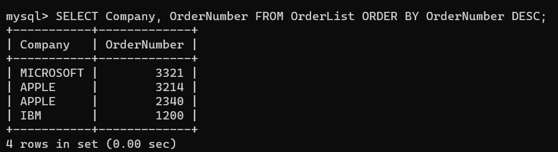
## <font color=#FF6600>INSERT INTO</font>

INSERT INTO是SQL用來新增紀錄的語法，它的結構像是以下這樣:
```sql
INSERT INTO 表名稱 VALUES (值1, 值2,....);
```
這樣的寫法是預設每一列都要插入資料，若想指定列的話，可以在表格前加入括號來選定要插入的列(沒選擇的會以預設值插入):
```sql
INSERT INTO 表名稱 (列1, 列2,...) VALUES (值1, 值2,....);
```
像是如果要往上面的表內插入新的一行資料，可以這樣寫:
```sql
INSERT INTO OrderList (Company,OrderNumber) VALUES ("GOOGLE",2345);
```
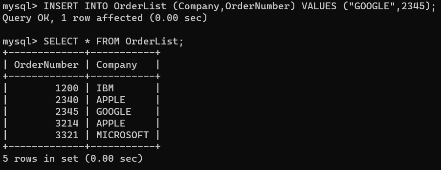
## <font color=#FF6600>UPDATE</font>
UPDATE專門用來更新資料，結構如下:
```sql
UPDATE 表名稱 SET 列名稱 = 新值 WHERE 運算符(條件);
```
若我要將上圖OrderNumber=1200的公司改為ACER，那就可以這樣寫:
```sql
UPDATE OrderList SET Company = 'ACER' WHERE OrderNumber = 1200;
```
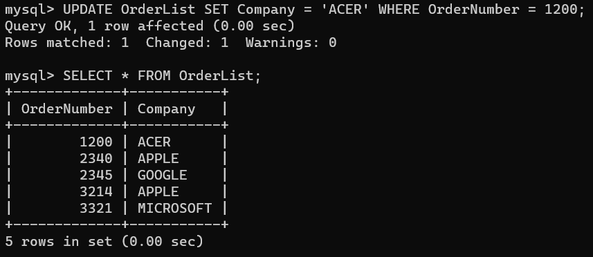
這個語法也可以同時更新多個值:
```sql
UPDATE OrderList SET OrderNumber = 1210,Company = 'ASUS' WHERE Company = 'GOOGLE';
```
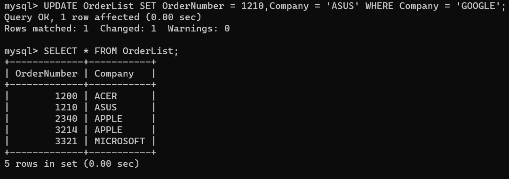
## <font color=#FF6600>DELETE</font>
DELETE用來刪除資料，結構如下:
```sql
DELETE FROM 表名稱 WHERE 運算符(條件);
```
若我要APPLE的資料都刪掉，可以這樣輸入指令:
```sql
DELETE FROM OrderList WHERE Company = 'APPLE';
```
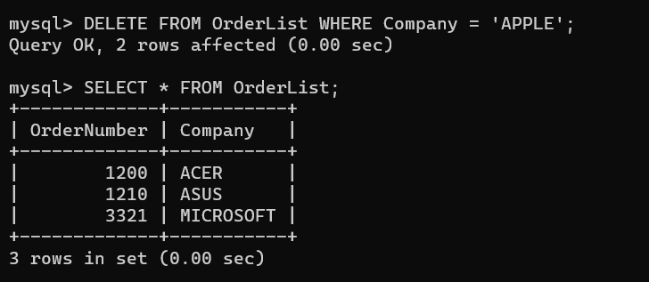
若不加WHERE條件，則代表刪除整個表內的紀錄，但表的結構還會留著:
```sql
DELETE FROM OrderList;
```
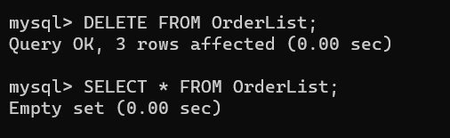